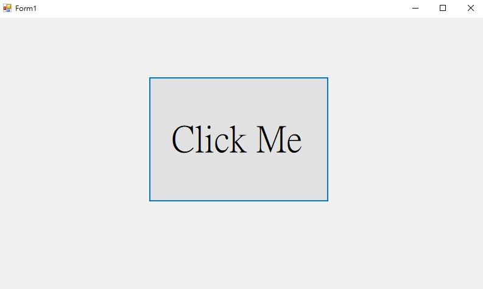
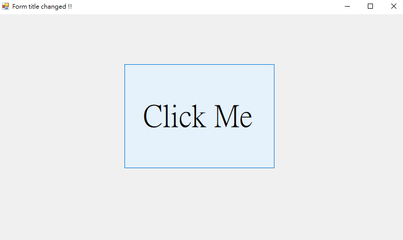

# Button Event

## Overview
This C# Windows Forms application demonstrates a simple user interface with a button that changes the title of the form when clicked.

## Code Description

### Main Components
1. **Form1 Class**:
   - This class inherits from the `Form` class, which is the base class for Windows Forms.

2. **Constructor**:
   - The `Form1()` constructor initializes the form and calls the `InitializeComponent()` method, which is generated by the designer to set up the form's components.

3. **Button Click Event**:
   - The `button1_Click` method is an event handler for the button click event. When the button is clicked, the title of the form is changed to "Form title changed !!".

## Demo Result

