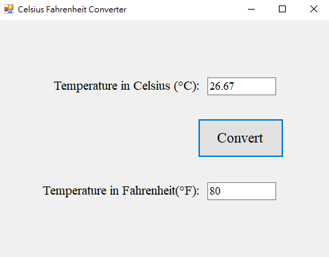

# Temperature Converter

## Overview
This application allows users to convert temperatures between Celsius and Fahrenheit. Users can input a temperature in either Celsius or Fahrenheit, and the corresponding temperature will be calculated and displayed in the other unit.

## Features
- Input temperature in Celsius or Fahrenheit.
- Automatic conversion to the other temperature unit.
- Clear input fields when switching focus between text boxes.
- User-friendly interface with error handling for empty inputs.

## How It Works
1. **Celsius Input:** Enter a temperature in the Celsius text box. When the convert button is clicked, the application calculates the corresponding temperature in Fahrenheit.
2. **Fahrenheit Input:** Enter a temperature in the Fahrenheit text box. When the convert button is clicked, the application calculates the corresponding temperature in Celsius.
3. **Clear on Focus:** When a text box gains focus, the other text box is cleared to prevent confusion.

## Demo Result

 
 