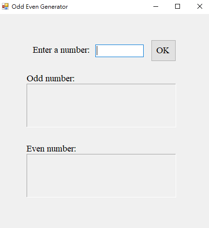
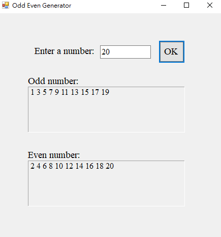

# Odd/Even Number Generator

## Overview
The Odd/Even Number Generator is a simple Windows Forms application designed to take a positive integer input and display all odd and even numbers up to that integer. This tool helps users easily identify the classification of numbers within a specified range.

## Features
- Accepts a positive integer input.
- Displays all odd numbers from 1 to the specified integer.
- Displays all even numbers from 1 to the specified integer.
- Input validation to ensure a positive integer greater than 0 is entered.

### Usage
1. Enter a positive integer in the input field.
2. Click the "OK" button to generate odd and even numbers.
3. Results will be displayed in separate labels for odd and even numbers.
4. If an invalid input is entered, a message box will prompt you to enter a valid positive integer greater than 0.

## Demo Result

- If you enter **20**, the application will display:
    
  - Odd Numbers: **1 3 5 7 9 11 13 15 17 19**
  - Even Numbers: **2 4 6 8 10 12 14 16 18 20**