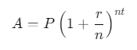
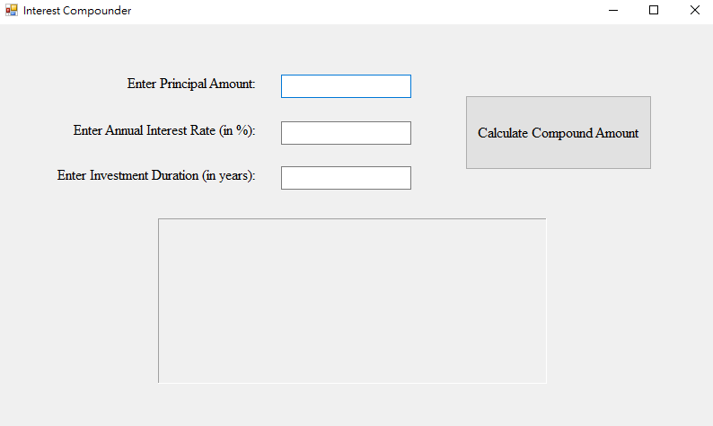
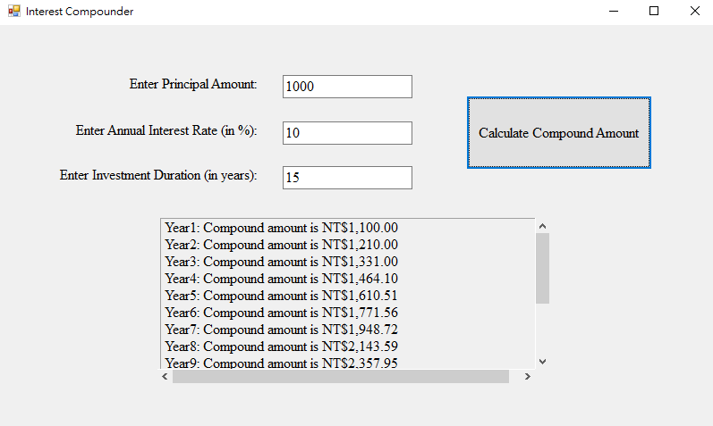

# Compound Interest Calculator

## Overview
This project provides a simple application to calculate the future value of an investment or loan using the compound interest formula. The application allows users to input their principal amount, annual interest rate, and the investment duration in years.

## Formula
The future value \( A \) is calculated using the formula:

Where:
- `A`= Future value of the investment/loan, including interest
- `P`= Principal investment amount (initial deposit or loan amount)
- `r` = Annual interest rate (in decimal form)
- `n` = Number of times interest is compounded per year, set 1
- `t` = Number of years the money is invested or borrowed

## Features
- Input for principal amount
- Input for annual interest rate
- Input for the duration of the investment
- Displays the future value of the investment

## Demo Result

