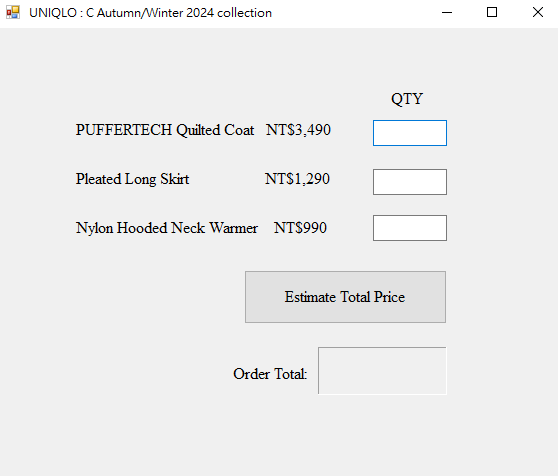
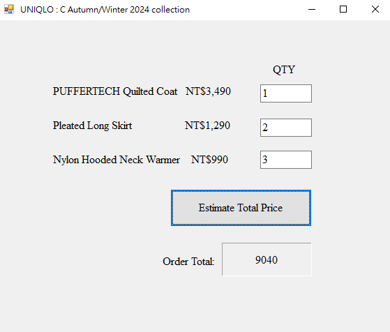

# Clothing Order Calculation System

## Overview
This project is a simple application for calculating the total price of clothing items based on user input. Users can specify the quantity of different clothing types, and the application computes the total cost.

## Features
- Calculate the total price of coats, skirts, and warmers.
- User-friendly interface for entering quantities.
- Displays the total amount due clearly.

## Usage
1. Enter the quantity of each clothing item in the designated fields.
2. Click the "Estimate Total Price" button to compute the total cost.
3. The total price will be displayed on the screen.

## Demo Result

