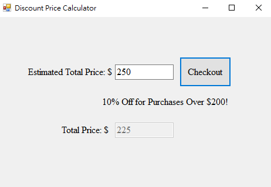

# Discount Price Calculator

## Overview
The Discount Price Calculator is a simple Windows Forms application that calculates the total price of a purchase after applying a discount. If the total amount exceeds $200, a 10% discount is applied.

## Features
- Input a price amount.
- Automatically calculates the total price after applying a 10% discount for purchases over $200.
- Displays the discounted price in a currency format.
- User-friendly interface that clears previous results upon input focus.

### Usage
1. Enter the price in the input field.
2. Click the "Check" button to calculate the total price.
3. If the entered amount is over $200, a 10% discount will be applied, and the discounted total will be displayed.
4. The discount field will clear when you focus on the price input.

## Demo Result

- If you enter **$150**, the application will display **$150.00** with no discount applied.

- If you enter **$250**, the application will display **$225.00** as the total price after the discount.

