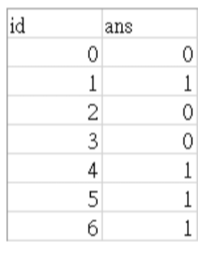

# Data Science HW1: Weather Model Training for Rainfall Prediction

## Homework Description
This homework involves using data from Kaggle, divided into training data (訓練資料) and test data (測試資料). The task is to first use weather observation samples from the training data to train a model. Then, use the model to predict test data (by inputting observation data for a given day and predicting whether it will rain the next day).

## Data Fields Description
- **Attribute 1**: Date (當天日期)
- **Attribute 2**: Location of the weather station (氣象站的地區)
- **Attribute 3**: Minimum temperature (最低溫度) in Celsius
- **Attribute 4**: Maximum temperature (最高溫度) in Celsius
- **Attribute 5**: Rainfall (降雨量) in millimeters
- **Attribute 6**: Evaporation (蒸發量)
- **Attribute 7**: Hours of sunshine (當天陽光出現的時數)
- **Attribute 8**: Wind direction at 9 am (早上九點的風向)
- **Attribute 9**: Wind direction at 3 pm (下午三點的風向)
- **Attribute 10**: Average wind speed before 9 am (早上九點前的平均風速) in km/h
- **Attribute 11**: Average wind speed before 3 pm (下午三點前的平均風速) in km/h
- **Attribute 12**: Relative humidity at 9 am (早上九點的相對濕度)
- **Attribute 13**: Relative humidity at 3 pm (下午三點的相對濕度)
- **Attribute 14**: Average atmospheric pressure before 9 am (早上九點前的平均大氣壓) in hPa
- **Attribute 15**: Average atmospheric pressure before 3 pm (下午三點前的平均大氣壓) in hPa
- **Attribute 16**: Cloud cover at 9 am (早上九點，雲層遮蓋天空的比例) (0 = clear sky, 8 = fully overcast)
- **Attribute 17**: Cloud cover at 3 pm (下午三點，雲層遮蓋天空的比例) (0 = clear sky, 8 = fully overcast)
- **Attribute 18**: Temperature at 9 am (早上九點的溫度)
- **Attribute 19**: Temperature at 3 pm (下午三點的溫度)
- **Attribute 20**: Did it rain today (今天有沒有下雨)
- **Attribute 21**: Will it rain tomorrow (明天會不會下雨) (Label)

## Submission Instructions
- Generate prediction results for Attribute 21. Possible values are 0 or 1 (no rain or rain).
- The format should be as follows:
    - 
    - The uploaded file should contain 823 prediction results, with 2 columns.
    - The first column is id (from 0 to 822, total 823 rows).
    - The second column is ans (prediction of whether it will rain tomorrow, 0 for no rain, 1 for rain).

## Leaderboard Information
- The private leaderboard is calculated with approximately 60% of the test data. This leaderboard reflects the final standings.
  - **Private score**: 0.81376
- The public leaderboard is calculated with approximately 40% of the test data. The final results will be based on the other 60%, so the final standings may be different.
  - **Public score**: 0.81155
