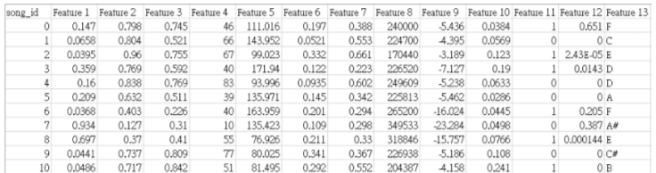
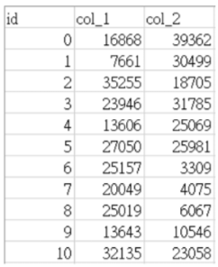
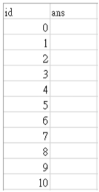

# Clustering Songs Using Feature Analysis

## Homework Description
The goal is to cluster songs based on their features. Each row in the dataset represents a song with a unique `song_id` and 13 features. Use these features to cluster songs such that similar songs are grouped together. Song genres may include electronic, hip-hop, rock, etc., and songs of the same genre typically share similar features.

## Data Fields Description
- **Feature 1**: Acousticness of the song. The closer to 1, the less electronic music components it contains.
- **Feature 2**: Energy level of the song. Higher values indicate more energetic, loud, and potentially noisy songs.
- **Feature 3**: Danceability of the song. Based on rhythm and stability, values closer to 0 indicate less suitable for dancing, while values closer to 1 indicate more suitable.
- **Feature 4**: Popularity of the song, based on the number of plays. Higher values indicate more popularity.
- **Feature 5**: Tempo of the song, measured in Beats Per Minute (BPM).
- **Feature 6**: Probability of the song being recorded live. Higher values indicate a higher likelihood of being live or concert recordings.
- **Feature 7**: Valence of the song. Higher values indicate more positive emotions (happy, cheerful), while lower values indicate more negative emotions (angry, sad).
- **Feature 8**: Duration of the song, measured in milliseconds.
- **Feature 9**: Loudness of the song, measured in decibels (dB).
- **Feature 10**: Presence of spoken words. Higher values may indicate spoken content like podcasts; lower values may indicate purely musical content.
- **Feature 11**: Mode of the song (major=0, minor=1).
- **Feature 12**: Instrumentalness of the song. Higher values indicate a greater proportion of instrumental music.
- **Feature 13**: Pitch of the song, mapped based on the standard Pitch class.

## Submission Instructions
- **Train.csv**: Contains `song_id` for each song along with 13 features, encompassing 40,114 songs in total.

- **Test.csv**: Requires determining if the songs with `song_id` in `col_1` and `col_2` belong to the same cluster.
  - 
  - Example: For `id=0`, determine if songs with `song_id` 16,868 and 39,362 belong to the same cluster.
- **Submit.csv**: The submission file where the results are recorded. If two songs belong to the same cluster, write 1; otherwise, write 0.
  - 
  - Example: For `id=0`, the `ans` column should contain the result of whether songs with `song_id` 16,868 and 39,362 are of the same type. Continue this for a total of 4000 song pairs.

## Leaderboard Information
- The private leaderboard is calculated with approximately 60% of the test data. This leaderboard reflects the final standings.
  - **Private score**: 0.51562
- The public leaderboard is calculated with approximately 40% of the test data. The final results will be based on the other 60%, so the final standings may be different.
  - **Public score**: 0.52583
